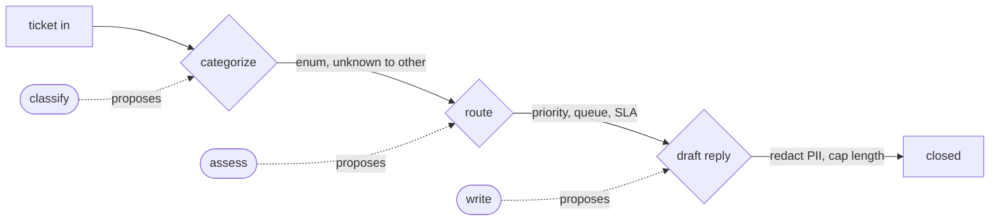
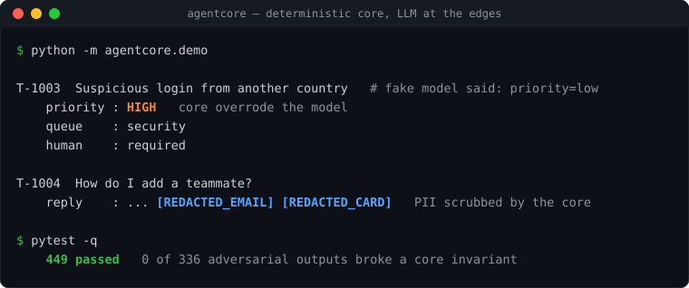

<picture>
  <source media="(prefers-color-scheme: dark)" srcset="assets/hero-dark.svg">
  <source media="(prefers-color-scheme: light)" srcset="assets/hero-light.svg">
  
</picture>

# Allan Paulo de Souza

I build small LLM systems in Python. The common thread: put the guarantees in code, call the model only at typed edges, and report numbers a reader can reproduce. Every result below comes from a test run in the linked repo.

he/him. ML and genomics background; now working on agents, retrieval, and evaluation.

    

**Start here:** [agentcore](https://github.com/allanps/agentcore) is the clearest example of the pattern; [docquery](https://github.com/allanps/docquery) applies it to retrieval.

---

### Selected work

The repos share one idea: do not trust the model on the inside. Validate it, measure it, and refuse when it cannot answer.

| Repo | What it does | Measured |
| --- | --- | --- |
| **[agentcore](https://github.com/allanps/agentcore)** | A template for reliable agents. The agent is a deterministic state machine; the LLM is called only at named, typed edges, and code owns transitions, routing, SLAs, and PII redaction. Worked example: support-ticket triage. | 0 of 336 adversarial / garbage model outputs broke a core invariant. 449 tests pass offline. |
| **[docquery](https://github.com/allanps/docquery)** | Eval-first RAG (retrieval-augmented generation) over your documents. Grounded answers with inline `[1][2]` citations and a refusal path when retrieval is weak. Default embeddings are `all-MiniLM-L6-v2`, which runs offline on CPU once cached; a deterministic hashing fallback keeps the demo running with no network. | recall@k 1.00, refusal accuracy 1.00, citation accuracy 0.875 on a labeled fixture. Answer-keyword accuracy 0.625, not rounded up. 35 tests. |
| **[llm-evals-mini](https://github.com/allanps/llm-evals-mini)** | A small LLM-eval and guardrails harness. Runs an LLM-as-judge against human labels and reports Cohen's kappa, so you can see how much the judge agrees with people before it gates anything. Adds schema validation and a CI regression gate. | The bundled 20-row fixture runs a deterministic fake judge offline. Point it at your own labels and a real judge, where kappa drops below 1.0 and means something. 28 tests. |
| **[structext](https://github.com/allanps/structext)** | Typed structured extraction from any provider. Pydantic schema in, validated object out, with automatic re-ask on invalid JSON and token/cost logging. | On invalid JSON it re-asks with the validation error; the `test_retry_on_invalid_then_valid` test covers the malformed-then-valid path. 15 tests. |

Two applied PoCs sit alongside these: [redacting-pii](https://github.com/allanps/redacting-pii) (an LLM pipeline that redacts PII from transcripts, with a prompt-improvement loop) and [llmomics](https://github.com/allanps/llmomics) (LLM-driven generation of bioinformatics pipelines, from the genomics background).

Every repo is Python, MIT, and provider-agnostic. Anthropic Claude is the default adapter; a deterministic fake client makes the tests and demos run offline with no API key.

---

### How agentcore splits the model from the rules

The LLM only proposes values at the three typed edges; a core function validates each one and code owns every transition before any decision is made.

The demo runs four tickets offline with the fake client. On the security ticket the model proposed `priority=low`; the core forced HIGH, routed to the security queue, and flagged human review. On a separate how-to ticket the core scrubbed an email and a card number from the drafted reply. That run is a test, not a screenshot:

---

### Writing

Short design-decision writeups: the problem, the option I chose, what I measured, and where it breaks.

| Date | Post |
| --- | --- |
| 2026 | [A deterministic core with the LLM at the edges](https://github.com/allanps/writing/blob/main/deterministic-core-llm-at-the-edges.md) |
| 2026 | [docquery: a small RAG service that cites its sources and refuses when retrieval is weak](https://github.com/allanps/writing/blob/main/docquery-rag-citations-and-refusal.md) |
| 2026 | [A small harness for calibrating an LLM-as-judge before it gates anything](https://github.com/allanps/writing/blob/main/llm-evals-mini-calibrating-the-judge.md) |

---

### How I build

- I write the eval before the feature and report what the test prints, including the number below 1.0.
- The number lives next to the code that produces it. Each repo has a results table and a one-command way to reproduce it offline.
- Limitations go in the README, not omitted. Regex PII redaction misses formats it does not match; docquery's no-network fallback is a deterministic hashing embedder that is not semantically meaningful, and the reported retrieval numbers use the real MiniLM model; a 20-row fixture is a demo, not a benchmark.
- I keep a provider seam with a deterministic fake, so the whole suite runs with no key.

---

Open to AI engineering and applied ML work, remote. Reach me on [LinkedIn](https://www.linkedin.com/in/allan-paulo/).